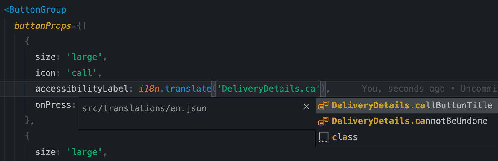

# Shopify i18n README

Autocompletion, go to definition, and diagnostics for [@shopify/react-i18n](https://github.com/Shopify/quilt/tree/master/packages/react-i18n).

## Instructions

- Run the following command to build a VSIX package:

`yarn package`

- In order to test the extension in the dev environment, just simply run the "Run extension" task in vscode.

## Demo

**Go to definition and hover provider**

**Autocomplete**

